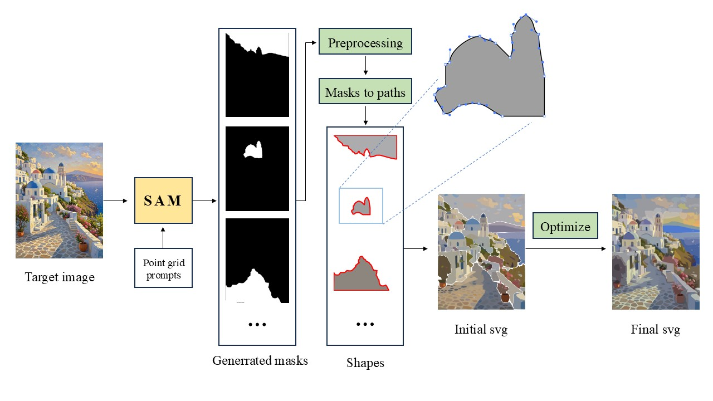
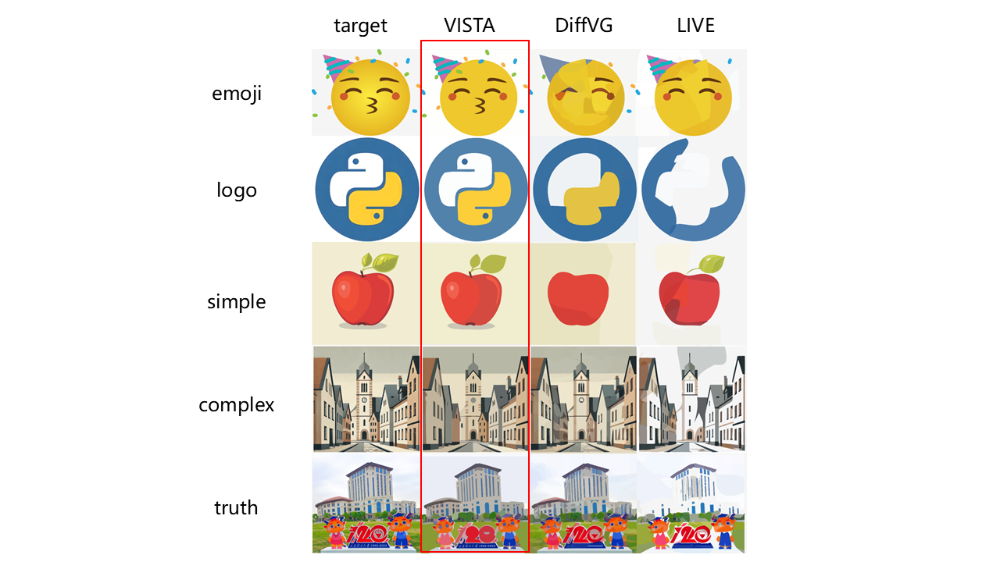
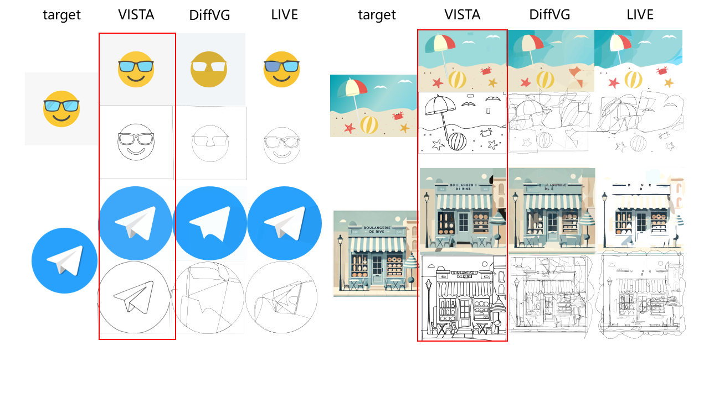

# VISTA: Vectorization using Image Segmentation and Tuned Optimization Algorithm

## Overview








> VISTA (Vectorization using Image Segmentation and Tuned Optimization Algorithm) is an open-source image vectorization framework that combines the Segment Anything Model (SAM) for semantic segmentation with DiffVG for differentiable rendering and path optimization. This project addresses the limitations of existing vectorization methods, such as domain-specificity, shape redundancy, and dense path points, by generating high-fidelity, compact, and editable SVG files. VISTA is designed for general-purpose image vectorization, supporting a wide range of image categories from simple icons to complex photographs.

## Installation

We suggest users to use the conda for creating new python environment.

```python
git clone https://github.com/Muyi3927/VISTA.git
cd VISTA
conda create -n vista python=3.10
conda activate vista
conda install pytorch==1.13.1 torchvision==0.14.1 torchaudio==0.13.1 pytorch-cuda=11.7 -c pytorch -c nvidia
```

```python
# install pydiffvg
git clone https://github.com/BachiLi/diffvg.git
cd diffvg
git submodule update --init --recursive
conda install -y numpy
conda install -y scikit-image
conda install -y -c anaconda cmake
conda install -y -c conda-forge ffmpeg
pip install svgwrite
pip install svgpathtools
pip install cssutils
pip install numba
pip install torch-tools
pip install visdom
python setup.py install
```

```python
cd ..
pip install -r requirements.txt
```

## Model Checkpoints

- **`SAM`: [ViT-H SAM model.](https://dl.fbaipublicfiles.com/segment_anything/sam_vit_h_4b8939.pth)**

## Run

```
conda activate vista
# modify config.py (PROJECT_PATH、FILE_NAME、DATA_PATH ===> your real path)
python vista_main.py
```


